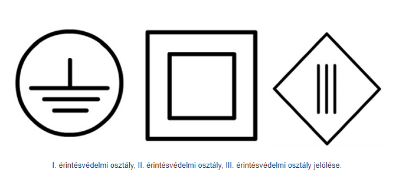

## Villamos áramütés:
1. Áram erősségétől
2. Időtartamtól
3. Áram útja az emberi testen
4. Áram frekvenciájától
5. Emberi test ellenállásától, amely egyénenként változó

!! **Áramerősség**
!!* 1mA érzékelési küszöb
!!* 10-15mA elengedési küszöb
!!* 20mA felett légzési, szívműködési problémák

## Villamos áram élettani hatásai
* vegyi hatás
* hőhatás
* sokkhatás
* izomzatra gyakorolt hatás

!!!! **Áramütés elleni védelem (Érintésvédelem)**  Villamos berendezések, készülékek és vezetékek üzemszerűen feszültségmentes, de meghibásodás esetén feszültség alá kerülő részeinek érintéséből adódó villamos balesetek megakadályozása

## Érintésvédelmi osztályok

* O. osztály - csak üzemi szigeteléssel rendelkezik, a védelem a környezeten alapul
* I. osztály - üzemi szigetelésen mellett védőföldelés v. nullázás
* II. osztály - üzemi szigetelés mellett kettős vagy megerősített szigeteléssel látják el
* III. osztály - törpefeszültségű táplálás (max. 50V)

## Védőföldelés
Valamely testnek, vezetőanyagú tárgynak vagy vezetőnek a földdel való közvetlen vagy közvetett összeköttetése.
**Földelő** a talajjal közvetlenül érintkezésben lévő és azzal villamos összeköttetést létesítő vezetőképes rész vagy vezetőképes részek együttese.

### Földelő típusok
* rúd vagy csőföldelők
* szalag vagy huzalföldelők
* lemezföldelők
* földbeásott vörösrészsodrony
* a talajjal közvetlenül érintkező vasbeton szerkezetek